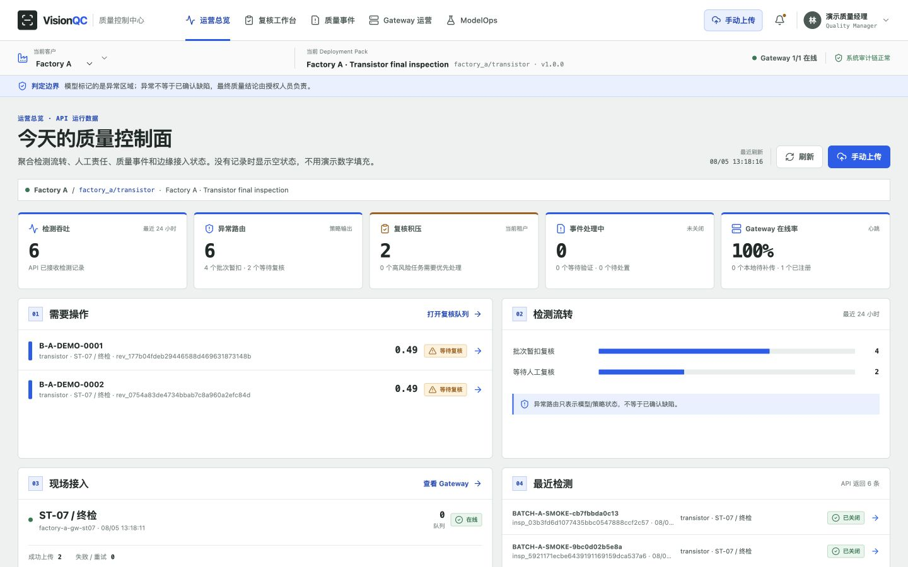

# VisionQC

面向工业质量复核的 AI 系统工程原型：把模型证据接入人工审核、ModelOps 发布门禁和可审计的 MES/QMS 动作边界。

## Problem

模型排序分数很高，也可能在选定阈值下自动放行异常品。VisionQC 检查检测之后的决策与操作：哪些样本要复核、谁能确认处置、外部动作失败如何恢复、什么证据允许模型上线。

当前为 Pre-Pilot 原型。默认使用演示数据，MES/QMS 使用 Mock。MVTec 公开基准不代表工厂现场效果。[MVIS](https://github.com/wangkeyu-u/mvis-industrial-vision-pilot) 研究模型、训练和定位评估；本仓库侧重 ModelOps、人工复核、权限和审计。



## Engineering Decisions

- [业务门禁优先于单一 AUROC](docs/decisions/001-business-gates.md)：阈值产生的放行/复核/暂扣结果需要独立验证。
- [服务端复核与并发控制](docs/decisions/002-human-review.md)：认领、版本和权限校验防止过期客户端覆盖处置结果。
- [隔离 MES/QMS 写入边界](docs/decisions/003-connector-boundary.md)：用确定性流程控制可审计动作，模型输出不直接授权外部写入。

## 系统闭环


更完整的组件边界、信任边界和时序见 [系统架构](docs/ARCHITECTURE.md)。

## 已验证结果

下面的模型指标来自保留的历史报告；本次重跑的是软件工作流及合成样本的模型契约测试，未重跑原始 MVTec 基准。

### 公开 Benchmark

MVTec AD `transistor` 使用 213 张正常训练图、50 张 validation 和 50 张冻结 holdout。阈值只由 validation 产生，holdout 不参与调参。

| 指标 | 结果 | 解释 |
| --- | ---: | --- |
| Image AUROC | 1.000 | 排序能力良好 |
| Pixel AUROC | 0.9722 | 异常区域定位能力良好 |
| AUPRO | 0.9411 | 区域重叠质量良好 |
| Warm P95 | 96.6 ms | 历史报告中的 Apple Silicon 环境 |
| 异常自动放行率 | 30% | **业务 Gate 失败** |
| Review + Hold Recall | 70% | **业务 Gate 失败** |
| Hold Recall | 50% | **业务 Gate 失败** |

最终状态为 `BENCHMARK_NO_GO / DRAFT_ONLY`。这说明高 AUROC 不等于安全可上线；VisionQC 会把不满足业务风险门槛的候选留在 DRAFT。完整说明见 [Benchmark 评测报告](reports/benchmark-evaluation.md)。

### 自动化验证（2026-09-15 复测）

| 模块 | 当前结果 |
| --- | ---: |
| Backend | 37 passed；隔离数据库和 Mock 外部系统 |
| ML | 36 passed；含小型合成数据 PatchCore 流程 |
| Edge Gateway | 17 passed |

命令、环境与剩余边界见 [验证记录](docs/experiments/workflow-validation.md)。Frontend 与双客户 Compose 冒烟仍保留运行说明，不计入本次上述复测数字。

## Baseline / Failure Cases / Ablation

设计对照是只按模型排序分数放行。真实历史失败是 `AUROC=1.000` 时仍有 30% 异常自动放行；当前门禁把候选留在 DRAFT。见 [失败记录](docs/failures/001-benchmark-no-go.md)。代码测试覆盖推理失败转复核、并发复核冲突、跨租户访问和 Connector 失败恢复。

目前没有测量“增加人工审核降低多少现场缺陷率”的组件消融。业务门禁拒绝错误候选是软件行为证据，不等于生产收益。保守门禁增加复核负担；真实客户需要单独确定可接受阈值。

## 运行

```bash
cd infra
docker compose up --build
```

服务就绪后打开 [localhost:3000](http://localhost:3000)。默认使用演示资料和 Mock 外部系统；关闭环境使用 `docker compose down`。

[运行与验证](OPERATIONS.md) 包含数据导入、Blender 样本生成、分模块测试和 Compose 冒烟命令。

## 仓库结构

```text
backend/       FastAPI、质量工作流、RBAC、审计、数据注册、MES/QMS
edge-gateway/  稳定文件检测、图片质量门禁、SQLite 断网队列、幂等补传
frontend/      React + TypeScript 工业质量控制台
ml/            PatchCore、数据 manifest、校准、评测、模型包、Registry
infra/         Docker Compose 与 Mock 外部系统
docs/          架构、部署、验收、案例与演示材料
reports/       可公开的 Benchmark 与模型评测摘要
tools/blender/ 可复现的工业工位、产品、缺陷和掩码生成器
```

## 安全与声明边界

- 模型只提供异常证据和异常区域，不确认语义缺陷类型或根因。
- 推理失败、模型包损坏或证据不完整时进入安全复核，不自动放行。
- 暂扣、返工、报废和外部系统写操作要求确定性策略与人工权限。
- 校准只读取 validation；冻结 holdout 仅用于最终评测。
- Benchmark 和演示数据永远不能使模型进入 `APPROVED / ACTIVE`。
- 客户 Pilot 需要租户、工厂、产线、相机、产品、采集窗口、标签来源、审批、授权和保留策略。

当前明确未生产化：企业 OIDC、PostgreSQL RLS、真实相机驱动、Kafka、Kubernetes、真实 MES/QMS，以及真实客户现场效果证明。

## 技术文档

- [系统架构与信任边界](docs/ARCHITECTURE.md)
- [As-Is / To-Be 与 48 小时客户接入案例](docs/CASE-STUDY.md)
- [Benchmark 评测报告](reports/benchmark-evaluation.md)
- [三分钟演示脚本](docs/DEMO-SCRIPT.md)
- [产品需求与系统规格](docs/01-product-requirements.md)
- [Deployment Pack 接入手册](docs/03-deployment-pack-onboarding.md)
- [现场验收测试](docs/06-site-acceptance-test.md)

## AI-assisted Development

[AI 辅助范围与技术责任](docs/AI_ASSISTED_DEVELOPMENT.md) 说明本次代码核查、测试和文档整理方式。架构决策、评估解释与最终验收需要可查证据，历史失败和归属保持可见。
