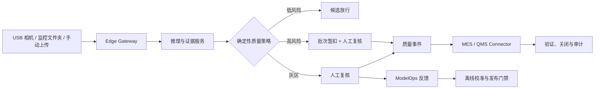

# VisionQC

**可配置的工业视觉质量闭环平台 / Configurable industrial quality platform**

VisionQC 不止回答“图片是否异常”，还负责检测之后的企业流程：证据留存、双阈值路由、人工复核、批次暂扣、MES/QMS 动作、模型发布门禁和全链路审计。平台以配置优先的 Deployment Pack 交付：行业默认能力由 Industry Pack 提供，客户只需生成 tenant/site overlay，即可适配产品、字段、采集规则、策略、审批和 Connector，不需要 fork 业务代码。

仓库内置三个明确标注为 synthetic configuration 的行业示例：electronics/transistor、packaging/bottle 和 automotive-paint/painted body panel。它们证明同一套 edge 与连接器边界可以切换租户；示例模型、外部系统和数据均不是生产证据。

> 当前定位：可运行的企业级作品集 / Pre-Pilot MVP。默认使用演示数据；MVTec 仅作为非商业公开基准，不代表任何工厂现场效果。


## 为什么不是普通缺陷检测 Demo

| 能力 | VisionQC 的实现 |
| --- | --- |
| 检测 | PatchCore 异常分数、像素级热力图、可校验模型包 |
| 决策 | `AUTO_RELEASE / REVIEW_REQUIRED / BATCH_HOLD_AND_REVIEW` 双阈值策略 |
| 人在回路 | 复核认领、乐观锁、理由与确认门槛、模型反馈 |
| 业务闭环 | Mock MES 暂扣/放行、Mock QMS 工单、事件验证与关闭 |
| 多客户适配 | Industry Pack 与 tenant/site overlay、字段映射、产品与 Connector 隔离 |
| ModelOps | DRAFT → EVALUATED → APPROVED → ACTIVE，职责分离与回滚审计 |
| 数据治理 | 演示、官方 Benchmark、客户 Pilot 三种来源；不可变 fingerprint |
| 安全降级 | 推理或证据失败时禁止自动放行；业务 Gate 失败阻断模型上线 |

## 系统闭环



更完整的组件边界、信任边界和时序见 [系统架构](docs/ARCHITECTURE.md)。

## 已验证结果

### 公开 Benchmark

MVTec AD `transistor` 使用 213 张正常训练图、50 张 validation 和 50 张冻结 holdout。阈值只由 validation 产生，holdout 不参与调参。

| 指标 | 结果 | 解释 |
| --- | ---: | --- |
| Image AUROC | 1.000 | 排序能力良好 |
| Pixel AUROC | 0.9722 | 异常区域定位能力良好 |
| AUPRO | 0.9411 | 区域重叠质量良好 |
| Warm P95 | 96.6 ms | 当前 Apple Silicon 本地环境 |
| 异常自动放行率 | 30% | **业务 Gate 失败** |
| Review + Hold Recall | 70% | **业务 Gate 失败** |
| Hold Recall | 50% | **业务 Gate 失败** |

最终状态为 `BENCHMARK_NO_GO / DRAFT_ONLY`。这说明高 AUROC 不等于安全可上线；VisionQC 会把不满足业务风险门槛的候选留在 DRAFT，而不是粉饰成生产结果。完整说明见 [Benchmark 评测报告](reports/benchmark-evaluation.md)。

Pilot Gate Recovery 的安全契约已经固定为：异常自动放行 `= 0`（硬门禁）；Review + Hold 异常召回率 `≥ 95%`；Hold 异常召回率 `≥ 80%`；正常样本进入人工复核 `≤ 35%` 是明确的运营目标。阈值只能由 `validation` 选择，冻结 holdout 只用于一次最终报告；校准失败、OOD 或图片质量失败均保持 `DRAFT` 并转入人工复核/Hold。

### 自动化验证

| 模块 | 当前结果 |
| --- | ---: |
| Backend | 以 `docs/TEST-REPORT.md` 的最终记录为准 |
| ML | 以 `docs/TEST-REPORT.md` 的最终记录为准；可选 PatchCore 运行时缺失会明确标记 |
| Edge Gateway | 以 `docs/TEST-REPORT.md` 的最终记录为准 |
| Frontend | 以 `docs/TEST-REPORT.md` 的最终记录为准 |
| 多租户闭环 | 三个行业示例、模拟 MES/QMS 与跨租户隔离 |

## 三分钟体验

### 完全不懂代码：双击启动（macOS）

1. 安装并启动 [Docker Desktop](https://www.docker.com/products/docker-desktop/)。
2. 在项目文件夹中双击 `start-demo.command`。
3. 浏览器打开后，点击首页的“使用演示图片开始”。
4. 体验结束后双击 `stop-demo.command`。

详细截图式说明、常见问题和术语解释见 [零基础使用指南](docs/BEGINNER-GUIDE.md)。

### 熟悉终端：命令启动

```bash
cd infra
docker compose up --build api frontend edge-gateway-selected
```

`edge-gateway-selected` 通过一个配置路径选择租户。默认是 electronics 示例；切换到其他 checked-in 示例时只改环境变量：

```bash
VQC_GATEWAY_PACK_PATH=/app/configs/examples/packaging-bottle/resolved-deployment-pack.json \
VQC_GATEWAY_ID=example-packaging-gateway \
docker compose -f infra/docker-compose.yml up --build api frontend edge-gateway-selected
```

也可以一次启动三个行业 Gateway 示例：

```bash
cd infra
docker compose --profile industry-examples up --build api edge-gateway-electronics-example \
  edge-gateway-packaging-example edge-gateway-automotive-paint-example
```

服务就绪后打开：

- Web UI：[http://localhost:3000](http://localhost:3000)
- API 文档：[http://localhost:8000/docs](http://localhost:8000/docs)
- selected Gateway 状态：`8090`（端口可由 `VQC_GATEWAY_STATUS_PORT` 覆盖）
- 三行业示例 Gateway 状态：`8094 / 8095 / 8096`

推荐演示路径：

1. 在运营总览确认租户、Gateway 和待复核队列。
2. 上传异常图片，查看异常分数、热力图和策略证据。
3. 在复核工作台确认异常并触发批次暂扣。
4. 在质量事件中查看 MES/QMS 幂等动作并完成验证关闭。
5. 在 ModelOps 查看数据来源、Benchmark NO-GO 和模型 DRAFT 状态。

选择文件夹或 USB 相机前，页面会先做预检，并且只有显式同意上传时才会把原图发送给服务；默认本地处理。

完整口播和镜头表见 [三分钟演示脚本](docs/DEMO-SCRIPT.md)。停止环境：

```bash
cd infra
docker compose down
```

## 可选数据来源

项目不携带、不自动下载、也不要求 Benchmark 或客户数据。

| 来源 | 用途 | 可产生的最高状态 |
| --- | --- | --- |
| `DEMO_SYNTHETIC` | Blender 可复现合成样本与默认业务演示 | `DEMO_ONLY` |
| `OFFICIAL_BENCHMARK` | 实验室基准验证 | `READY_FOR_CUSTOMER_DATA` |
| `CUSTOMER_PILOT` | 客户现场 Pilot | 完整 provenance 与 Gate 通过后才可审批 |

受控上传会检查许可证确认、扩展名、压缩包路径穿越、特殊文件、文件数量、压缩/解压大小、压缩比和内容哈希。原始数据进入租户隔离对象存储，不进入 Git 或前端静态目录。服务端挂载导入在生产环境还必须配置 `VQC_DATASET_IMPORT_ROOTS`。

### Blender 合成演示

内置晶体管样本不是不可追溯的占位图，而是由
[`tools/blender/generate_transistor_demo.py`](tools/blender/generate_transistor_demo.py)
参数化生成。脚本会输出正常样本、弯折引脚缺陷、像素掩码、检测工位全景、SHA-256 清单和可编辑 `.blend` 场景。

```bash
/Applications/Blender.app/Contents/MacOS/Blender --background \
  --python tools/blender/generate_transistor_demo.py -- \
  --output-dir frontend/public/mock/blender \
  --blend-file artifacts/blender/visionqc-inspection-station.blend
```

Blender 合成数据只用于新手演示、接口联调和流程测试，不能替代 MVTec Benchmark，更不能证明客户现场效果。完整边界见 [Blender 合成数据说明](docs/07-blender-synthetic-data.md)。

汽车涂装面板/车身试片生成器为 [`tools/blender/generate_paint_quality_dataset.py`](tools/blender/generate_paint_quality_dataset.py)，覆盖 dust nib、scratch、paint run/sag、orange peel 四类视觉近似缺陷，并输出 RGB、二值 mask、annotation 和 provenance manifest。它仍然只标记为 `DEMO_SYNTHETIC`，不是物理喷涂仿真或生产证据。

## 仓库结构

```text
backend/       FastAPI、质量工作流、RBAC、审计、数据注册、MES/QMS
edge-gateway/  稳定文件检测、图片质量门禁、SQLite 断网队列、幂等补传
frontend/      React + TypeScript 工业质量控制台
ml/            PatchCore、数据 manifest、校准、评测、模型包、Registry
infra/         Docker Compose 与 Mock 外部系统
docs/          架构、部署、验收、案例与演示材料
reports/       可公开的 Benchmark 与模型评测摘要
tools/blender/ 可复现的工业工位、产品、缺陷和掩码生成器
```

## 可选的 automotive-paint 概念 overlay

Dürr demo tenant 是中性、无品牌资产的可运行场景，字段包含 `body_id/workpiece_id`、paint shop、booth/station、line、model variant、color code、paint recipe、shift、设备告警/工艺参数引用、根因候选和 disposition。`dxq_mock` 只实现概念层质量记录与模拟事件流，适配器隔离在连接器层；它不代表真实 DXQcontrol、DXQquality.management 或 DXQplant.analytics 协议。

公开业务理解依据见 [Dürr Pilot 概念说明](docs/DUERR-PILOT.md)，其中列出 Dürr 官方公开资料链接。中国 pilot 的概念前提是本地部署、中文操作、数据默认不出厂、可配置连接器和低改造接入；任何真实接入都需要 Dürr/客户正式授权与协议确认。

## 安全与声明边界

- 模型只提供异常证据和异常区域，不确认语义缺陷类型或根因。
- 推理失败、模型包损坏或证据不完整时进入安全复核，不自动放行。
- 暂扣、返工、报废和外部系统写操作要求确定性策略与人工权限。
- 校准只读取 validation；冻结 holdout 仅用于最终评测。
- Benchmark 和演示数据永远不能使模型进入 `APPROVED / ACTIVE`。
- 客户 Pilot 需要租户、工厂、产线、相机、产品、采集窗口、标签来源、审批、授权和保留策略。
- USB/文件夹采集默认不上传客户原图；用途、同意状态、保留期限和删除方式必须可见。
- OOD、模糊、曝光异常、无目标/视角偏差等无法安全判断的输入不得自动放行。

当前明确未生产化：企业 OIDC、PostgreSQL RLS、真实相机驱动、Kafka、Kubernetes、真实 MES/QMS，以及真实客户现场效果证明。

## 作品集材料

- [平台快速开始](docs/PLATFORM-QUICKSTART.md)
- [企业定制指南](docs/ENTERPRISE-CUSTOMIZATION.md)
- [Industry Pack 规范](docs/INDUSTRY-PACK-SPEC.md)
- [Connector SDK 开发指南](docs/CONNECTOR-DEVELOPMENT.md)
- [数据与安全边界](docs/DATA-SECURITY-BOUNDARY.md)
- [从 Dürr 定制迁移为示例](docs/DUERR-MIGRATION-EXAMPLE.md)
- [系统架构与信任边界](docs/ARCHITECTURE.md)
- [As-Is / To-Be 与 48 小时客户接入案例](docs/CASE-STUDY.md)
- [Dürr 汽车涂装 Pilot 概念说明](docs/DUERR-PILOT.md)
- [Benchmark 评测报告](reports/benchmark-evaluation.md)
- [三分钟演示脚本](docs/DEMO-SCRIPT.md)
- [简历写法与面试讲解](docs/RESUME.md)
- [产品需求与系统规格](docs/01-product-requirements.md)
- [Deployment Pack 接入手册](docs/03-deployment-pack-onboarding.md)
- [现场验收测试](docs/06-site-acceptance-test.md)
- [最终测试与已知限制](docs/TEST-REPORT.md)

## 完整回归

```bash
cd backend && uv sync --extra dev && uv run pytest -q
cd ../ml && uv sync --extra model --extra dev && uv run pytest -q
cd ../edge-gateway && uv sync --extra dev && uv run pytest -q
cd ../frontend && npm ci && npm test -- --run && npm run typecheck && npm run build
```

双客户 Compose 冒烟测试：

```bash
cd backend
uv run python ../scripts/compose_smoke.py
```

Dürr 模拟质量闭环冒烟：

```bash
cd backend
uv run python ../scripts/duerr_compose_smoke.py
```
