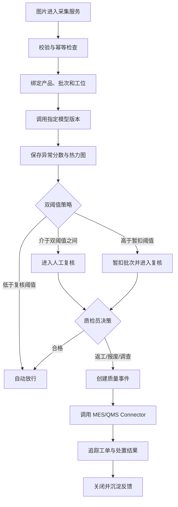

# VisionQC 产品需求与系统规格

| 文档属性 | 内容 |
| --- | --- |
| 文档编号 | VQC-PRD-001 |
| 版本 | 0.1.0 |
| 状态 | Draft for Review |
| 日期 | 2026-08-04 |
| 产品 | VisionQC |
| 首个部署包 | `factory_a/transistor` |
| 目标发布 | MVP / Portfolio Release |
| 产品负责人 | TBD |
| 技术负责人 | TBD |
| 审阅角色 | Product、ML、Backend、Frontend、Security、QA、Manufacturing SME |

## 1. 文档目的

本文档定义 VisionQC 第一阶段的业务目标、产品边界、功能需求、非功能需求、数据与接口契约、模型治理、安全策略、验收标准和发布门槛，是产品、研发、测试与交付工作的统一需求基线。

需求采用稳定编号管理。需求变更必须更新版本、影响范围和验收标准，不以口头约定替代文档基线。

## 2. 执行摘要

VisionQC 将工业视觉异常检测能力接入制造企业的质量管理流程。系统接收产品图片，调用 PatchCore 生成异常分数和像素级热力图，根据客户配置的双阈值策略决定自动放行、人工复核或批次暂扣。质检员完成复核后，系统通过 Connector 更新 MES、创建 QMS 质量工单、通知负责人，并保存模型版本、阈值版本、图片证据、人工决策和外部操作记录。

系统不将大语言模型作为视觉判定器。PatchCore 负责异常检测与定位；确定性策略负责路由；质检员负责最终质量决策；LLM 仅负责检索质量标准、生成复核清单、整理工单描述和起草带有待确认字段的质量报告。

第一版以 MVTec AD `transistor` 类别完成单客户闭环。第二阶段通过 Deployment Pack 验证不同客户字段、模型、阈值、审批策略和 Connector 的快速适配能力。

## 3. 背景与问题定义

### 3.1 当前流程假设

目标客户已具备摄像头或离线图片，但视觉检测、人工判定和质量系统之间缺少完整闭环，常见问题包括：

- 检测模型输出无法直接进入质量流程。
- 异常图片、人工结论、批次和工单之间缺少统一关联。
- 模型阈值、模型版本和质量规则的变更不可追溯。
- 外部系统调用失败时可能发生漏单或重复工单。
- 不同工厂字段、系统和审批规则差异较大，项目重复开发。
- 只统计模型准确率，无法衡量误放、误杀、人工负担和业务执行结果。

### 3.2 目标状态

VisionQC 应形成以下可审计闭环：

1. 接收并校验产品图片和业务上下文。
2. 固化本次推理使用的模型、特征库和阈值版本。
3. 输出异常分数、热力图和结构化检测结果。
4. 由策略引擎决定自动放行、人工复核或暂扣。
5. 由有权限的质检员确认放行、返工、报废或升级调查。
6. 通过幂等 Connector 写入 MES/QMS。
7. 追踪质量事件和外部工单直至关闭。
8. 将人工反馈纳入评测和后续校准数据，但不自动更新生产模型。

## 4. 产品愿景与原则

### 4.1 产品愿景

成为可快速部署到不同制造客户的视觉质量交付层，让成熟视觉模型以安全、可配置、可评测的方式进入生产质量流程。

### 4.2 设计原则

- **Human accountable**：高风险质量决策由具名人员负责。
- **Evidence first**：所有判断必须关联原图、热力图、模型版本和策略版本。
- **Deterministic execution**：外部写操作由确定性工作流执行，不由 LLM 自由调用。
- **Fail safe**：证据缺失、模型不可用或接口异常时进入复核或暂扣，不默认放行。
- **Tenant isolation**：客户数据、模型、阈值、凭据和审计记录严格隔离。
- **Config over fork**：客户差异优先由配置和 Connector 解决，避免复制核心代码。
- **Measurable delivery**：每次发布必须同时报告模型、系统和业务流程指标。

## 5. 目标与非目标

### 5.1 第一阶段目标

| ID | 目标 | 成功定义 |
| --- | --- | --- |
| OBJ-001 | 跑通单产品质量闭环 | 一张异常图片可从接收、推理、复核、暂扣、建单运行到关闭 |
| OBJ-002 | 提供可解释的视觉证据 | 每次检测均保存异常分数、热力图、模型版本和阈值版本 |
| OBJ-003 | 建立安全决策边界 | 模型不得直接执行报废；受控操作均经过策略与权限检查 |
| OBJ-004 | 建立可复现评测 | 固定数据切分、随机种子、模型包和阈值，生成版本化评测报告 |
| OBJ-005 | 验证生产可靠性 | 重复图片不重复建事件，Connector 重试不重复建工单 |
| OBJ-006 | 验证客户适配能力 | 第二部署包主要通过配置、模型包和 Connector 接入 |

### 5.2 非目标

- 不从零训练新的视觉基础模型。
- 不在第一版支持全部 15 类 MVTec AD 产品。
- 不宣称模拟数据等同于真实工厂上线效果。
- 不由 PatchCore 自动确定语义缺陷类型或根因。
- 不由 LLM 直接判定合格、报废或修改生产系统。
- 不在第一版接入真实 PLC、真实 MES、真实 QMS 或机械执行器。
- 不在第一版建设 Kubernetes、Kafka、大规模边缘集群或复杂多智能体系统。
- 不将自动在线学习纳入生产路径。

## 6. 假设与约束

### 6.1 业务假设

- 每张图片可关联到产品、批次、工位和采集时间。
- 客户能够定义质量处置策略和有权限的复核人员。
- 对外系统支持 API，或可由 Mock Connector 模拟。
- 第一阶段允许人工触发图片上传；自动文件夹/摄像头接入后续实现。

### 6.2 技术约束

- 第一模型为 Anomalib PatchCore，使用预训练视觉骨干和客户正常样本特征库。
- 第一数据集为 MVTec AD `transistor`，仅用于研究、评测和作品集演示。
- 商业使用前必须重新审查数据集、模型、权重和依赖许可证。
- 第一部署形式为 Docker Compose。
- PostgreSQL 是业务状态和审计元数据的事实来源。
- 图片和热力图通过对象存储抽象管理；本地开发可使用 MinIO 或本地兼容实现。

## 7. 利益相关方与用户角色

| 角色 | 主要目标 | 核心权限 |
| --- | --- | --- |
| 质检员 | 快速复核异常，减少误放和重复操作 | 查看图片/热力图，提交质量结论 |
| 质量主管 | 管理阈值、处置规则和质量事件 | 审批高风险操作，查看质量指标 |
| 产线操作员 | 了解批次是否可继续流转 | 查看有限状态，不可修改质量结论 |
| ML 工程师 | 校准模型并分析误检漏检 | 管理候选模型、执行离线评测 |
| 系统管理员 | 管理用户、客户配置与 Connector | 租户内系统管理，不具备业务审批权 |
| 审计/合规人员 | 追踪决策和系统操作 | 只读访问审计记录和导出报告 |
| FDE/交付工程师 | 将系统适配到新客户环境 | 创建 Deployment Pack、执行验收测试 |

### 7.1 权限分离原则

- 系统管理员不能代替质量主管批准报废或返工。
- ML 工程师不能直接将候选模型升级为生产模型。
- 质检员不能修改历史模型输出或审计记录。
- Connector 凭据只对运行时可见，不在 UI 和日志中展示。

## 8. 核心业务流程



### 8.1 质量状态

| 状态 | 含义 | 允许的下一状态 |
| --- | --- | --- |
| `RECEIVED` | 图片和上下文已接收 | `VALIDATED`、`REJECTED_INPUT` |
| `VALIDATED` | 格式、租户和幂等检查通过 | `INFERENCING` |
| `INFERENCING` | 模型执行中 | `SCORED`、`INFERENCE_FAILED` |
| `SCORED` | 已保存分数和热力图 | `AUTO_RELEASED`、`REVIEW_REQUIRED`、`BATCH_HELD` |
| `REVIEW_REQUIRED` | 等待质检员处理 | `RELEASE_APPROVED`、`NONCONFORMANCE_CONFIRMED`、`ESCALATED` |
| `BATCH_HELD` | 批次逻辑暂扣，等待确认 | `RELEASE_APPROVED`、`NONCONFORMANCE_CONFIRMED`、`ESCALATED` |
| `NONCONFORMANCE_CONFIRMED` | 人工确认不合格 | `ACTION_PENDING` |
| `ACTION_PENDING` | 等待外部系统操作 | `ACTION_EXECUTING` |
| `ACTION_EXECUTING` | Connector 调用中 | `ACTION_COMPLETED`、`ACTION_FAILED` |
| `ACTION_COMPLETED` | MES/QMS 操作成功 | `VERIFYING`、`CLOSED` |
| `VERIFYING` | 等待返工或调查结果 | `CLOSED`、`ESCALATED` |
| `CLOSED` | 事件完成 | 无 |

状态变化必须由已授权命令触发并写入不可覆盖的状态历史。

## 9. 功能需求

优先级定义：P0 为 MVP 阻断项，P1 为首个完整发布必需项，P2 为增强项。

### 9.1 图片采集与上下文

| ID | 优先级 | 需求 | 验收标准 |
| --- | --- | --- | --- |
| FR-ING-001 | P0 | 支持通过 API 或 Web 上传单张产品图片 | 合法 JPEG/PNG 可创建检测任务并返回唯一 `inspection_id` |
| FR-ING-002 | P0 | 图片必须携带租户、产品、批次、工位和采集时间 | 缺少必填上下文时返回结构化错误，不调用模型 |
| FR-ING-003 | P0 | 对图片内容和业务幂等键执行重复检测 | 同一幂等键重复提交只返回原任务，不重复推理或建单 |
| FR-ING-004 | P0 | 校验文件类型、大小、尺寸和可解码性 | 非法文件被拒绝并记录安全事件，不进入对象存储正式区 |
| FR-ING-005 | P1 | 保存原始图片哈希、接收来源和关联元数据 | 任一结果均可追溯到原始文件和来源 |
| FR-ING-006 | P2 | 支持受监控文件夹自动接收图片 | 新文件经稳定性检查后自动创建任务，失败文件进入隔离区 |

### 9.2 模型推理与模型注册

| ID | 优先级 | 需求 | 验收标准 |
| --- | --- | --- | --- |
| FR-ML-001 | P0 | 使用部署配置指定的 PatchCore 模型执行推理 | 每次推理记录模型 ID、版本、特征库版本和运行设备 |
| FR-ML-002 | P0 | 输出标准化异常分数和像素级异常图 | API 返回 `[0,1]` 标准化分数及热力图资源引用 |
| FR-ML-003 | P0 | 模型输出不得直接声明已确认的语义缺陷或根因 | UI 和 API 使用“异常区域/疑似问题”措辞 |
| FR-ML-004 | P0 | 推理失败必须进入安全状态 | 超时、OOM 或模型缺失时进入 `INFERENCE_FAILED` 并要求人工复核 |
| FR-ML-005 | P1 | 支持模型预热和健康检查 | 冷启动与预热后延迟分别可测，健康接口反映模型是否可服务 |
| FR-ML-006 | P1 | 生产模型升级需要注册、评测、审批和激活 | 未完成发布门槛的模型不能绑定到生产 Deployment Pack |
| FR-ML-007 | P1 | 支持回滚至前一已批准模型版本 | 回滚不修改历史结果，新的检测使用回滚版本 |
| FR-ML-008 | P2 | 支持第二种异常检测实现 | 通过 Model Adapter 接入，不修改核心质量工作流 |

### 9.3 决策策略

| ID | 优先级 | 需求 | 验收标准 |
| --- | --- | --- | --- |
| FR-POL-001 | P0 | 每个 Deployment Pack 配置复核阈值和暂扣阈值 | 满足 `review_threshold < hold_threshold`，非法配置无法激活 |
| FR-POL-002 | P0 | 低于复核阈值的样本可自动放行 | 放行记录包含策略版本和命中条件 |
| FR-POL-003 | P0 | 位于双阈值区间的样本进入人工复核 | 不执行外部质量写操作，直到人工提交决策 |
| FR-POL-004 | P0 | 高于暂扣阈值的样本触发逻辑暂扣并进入复核 | 暂扣动作可追踪，模型本身不能直接报废产品 |
| FR-POL-005 | P0 | 任一依赖缺失时执行安全降级 | 模型、策略或上下文不可用时不得自动放行 |
| FR-POL-006 | P1 | 策略版本必须可审计和回滚 | 历史检测保留当时使用的策略快照 |
| FR-POL-007 | P1 | 支持按产品、工位和客户覆盖阈值 | 优先级和继承规则有自动测试，冲突时拒绝激活 |

### 9.4 人工复核

| ID | 优先级 | 需求 | 验收标准 |
| --- | --- | --- | --- |
| FR-REV-001 | P0 | 复核页面并列展示原图、热力图、分数和上下文 | 质检员无需离开页面即可完成判断所需信息查看 |
| FR-REV-002 | P0 | 质检员可选择合格、返工、报废、调查或无法判断 | 每种决策均要求对应权限和必填字段 |
| FR-REV-003 | P0 | 返工、报废和调查必须记录原因与备注 | 缺少理由时不能提交，提交后不可原地覆盖 |
| FR-REV-004 | P0 | 人工决定必须保存操作者、时间和前后状态 | 审计查询可完整还原决策链 |
| FR-REV-005 | P1 | 支持分配、认领和转交复核任务 | 并发提交时仅一个有效决策成功，冲突返回 409 |
| FR-REV-006 | P1 | 支持质检员标记模型误检和疑似漏检 | 反馈进入独立评测数据集，不自动更新生产模型 |
| FR-REV-007 | P2 | 支持复核 SLA 与超时升级 | 超时任务通知质量主管并记录 SLA 违约 |

### 9.5 质量事件与闭环

| ID | 优先级 | 需求 | 验收标准 |
| --- | --- | --- | --- |
| FR-QC-001 | P0 | 人工确认不合格后创建唯一质量事件 | 一个检测记录最多关联一个有效主质量事件 |
| FR-QC-002 | P0 | 质量事件关联图片、热力图、批次、决策和证据 | 从事件页面可访问全部证据及其版本信息 |
| FR-QC-003 | P0 | 支持批次暂扣、释放、返工、报废和调查状态 | 状态转换遵守权限和前置条件 |
| FR-QC-004 | P1 | 可生成质量工单描述和复核检查清单 | 生成内容引用已知字段，未知根因明确标记为待调查 |
| FR-QC-005 | P1 | 可生成 8D 报告初稿 | 未经确认的 D4 根因与 D5 措施不得由模型填为事实 |
| FR-QC-006 | P1 | 追踪外部工单至关闭 | 外部状态更新映射到内部事件，异常映射进入人工处理 |
| FR-QC-007 | P1 | 关闭事件前验证必需结果 | 缺少处置结论、负责人或验证记录时不可关闭 |

### 9.6 MES/QMS Connector

| ID | 优先级 | 需求 | 验收标准 |
| --- | --- | --- | --- |
| FR-CON-001 | P0 | 提供 Mock MES Connector | 支持批次暂扣、释放和状态查询 |
| FR-CON-002 | P0 | 提供 Mock QMS Connector | 支持创建工单、查询工单和更新工单状态 |
| FR-CON-003 | P0 | 所有写操作必须携带幂等键 | 网络重试不会创建重复外部记录 |
| FR-CON-004 | P0 | Connector 超时、重试和最终失败可观测 | 使用有限重试与退避，最终失败进入待处理队列 |
| FR-CON-005 | P1 | 定义统一 Connector 接口和合同测试 | 新 Connector 必须通过共享合同测试才能启用 |
| FR-CON-006 | P1 | 外部响应保存必要摘要并脱敏 | 不记录访问令牌、密码或完整敏感载荷 |
| FR-CON-007 | P1 | 支持人工重放失败操作 | 重放需要权限、理由和新的审计事件，仍保持幂等 |

### 9.7 客户配置与租户隔离

| ID | 优先级 | 需求 | 验收标准 |
| --- | --- | --- | --- |
| FR-TEN-001 | P0 | 每条业务记录必须携带 `tenant_id` | 应用层和数据库访问均执行租户过滤 |
| FR-TEN-002 | P0 | 不同租户拥有独立模型、阈值、策略和 Connector 配置 | 工厂 A 用户无法访问或引用工厂 B 资源 |
| FR-TEN-003 | P1 | Deployment Pack 可版本化、校验和激活 | 配置变更经过 schema 校验并记录审批人 |
| FR-TEN-004 | P1 | 配置激活前执行连通性和兼容性检查 | 模型、对象存储和 Connector 任一检查失败则不激活 |
| FR-TEN-005 | P1 | 支持导出不含密钥的部署清单 | 清单可用于复现配置，但不泄露凭据 |

### 9.8 审计、评测与运营

| ID | 优先级 | 需求 | 验收标准 |
| --- | --- | --- | --- |
| FR-AUD-001 | P0 | 记录关键状态变化、人工操作、模型和策略决策 | 审计记录包含 actor、action、target、timestamp、correlation ID |
| FR-AUD-002 | P0 | 审计记录只追加，不允许普通用户修改或删除 | API 不提供更新/删除接口，管理操作同样留痕 |
| FR-AUD-003 | P1 | 支持按事件导出审计时间线 | 导出内容可重建检测到关闭的完整过程 |
| FR-EVAL-001 | P0 | 提供可复现离线评测命令 | 同一数据、代码和模型包运行得到容差内一致结果 |
| FR-EVAL-002 | P0 | 报告图像级和像素级模型指标 | 报告包含数据版本、阈值、硬件、模型版本和指标定义 |
| FR-EVAL-003 | P1 | 报告业务阈值指标 | 包含缺陷误放、良品误杀、人工复核率和人工修改率 |
| FR-EVAL-004 | P1 | 支持亮度、模糊、旋转和位移鲁棒性测试 | 报告给出每类扰动下的性能变化和失败样本 |
| FR-OPS-001 | P1 | 提供质量与系统运营看板 | 展示待复核量、SLA、异常率、Connector 成功率和模型分布漂移 |

## 10. LLM 辅助需求与边界

### 10.1 允许能力

- 根据产品和工位检索质量标准、作业指导书与历史案例。
- 将模型输出、业务上下文和检索结果整理为复核清单。
- 为质量事件生成结构化描述。
- 起草 8D 报告中的事实汇总、时间线和待调查项。
- 对操作员解释系统为何要求人工复核或暂扣。

### 10.2 禁止能力

- 直接修改视觉异常分数或阈值。
- 将异常热力图解释为已确认的缺陷类型。
- 在没有证据时生成根因、责任人或纠正措施。
- 绕过 RBAC、审批或策略引擎调用 MES/QMS。
- 自动发布模型、修改客户配置或清除审计数据。

### 10.3 输出约束

LLM 输出必须通过 Pydantic/JSON Schema 校验；引用质量标准时必须返回文档 ID 和版本；无法检索到依据时必须显式返回 `insufficient_evidence=true`。

## 11. 数据模型

### 11.1 核心实体

| 实体 | 关键字段 | 说明 |
| --- | --- | --- |
| Tenant | `id`, `name`, `status` | 客户隔离边界 |
| DeploymentPack | `id`, `tenant_id`, `version`, `status` | 模型、策略和 Connector 组合 |
| Product | `id`, `tenant_id`, `product_code`, `revision` | 被检产品定义 |
| Batch | `id`, `tenant_id`, `batch_no`, `status` | 生产批次及暂扣状态 |
| Inspection | `id`, `tenant_id`, `idempotency_key`, `status` | 单次检测主记录 |
| ImageAsset | `id`, `sha256`, `uri`, `mime_type`, `width`, `height` | 原图和衍生图资源 |
| InferenceResult | `inspection_id`, `model_version`, `score`, `heatmap_uri` | 不可覆盖的模型结果 |
| PolicyDecision | `inspection_id`, `policy_version`, `decision`, `reason` | 自动路由结果 |
| ReviewTask | `id`, `assignee`, `sla_at`, `status` | 人工复核任务 |
| ReviewDecision | `review_task_id`, `actor_id`, `decision`, `reason` | 人工质量结论 |
| QualityIncident | `id`, `inspection_id`, `status`, `severity` | 质量事件 |
| ExternalAction | `id`, `connector`, `idempotency_key`, `status` | MES/QMS 写操作 |
| ModelPackage | `id`, `version`, `dataset_fingerprint`, `metrics` | 模型注册信息 |
| AuditEvent | `id`, `tenant_id`, `actor`, `action`, `payload_digest` | 只追加审计事件 |

### 11.2 数据完整性规则

- `Inspection.idempotency_key` 在租户内唯一。
- `InferenceResult` 创建后不可修改；重新推理生成新 attempt。
- 所有图片资源记录 SHA-256，原始图片不被热力图覆盖。
- 审计记录保存前后状态摘要，不保存明文密钥。
- 历史记录引用具体模型和策略版本，不引用“当前版本”。
- 删除业务数据必须遵循保留策略并生成审计记录；第一版不提供硬删除 UI。

## 12. 接口契约草案

### 12.1 HTTP API

| 方法 | 路径 | 用途 | 幂等要求 |
| --- | --- | --- | --- |
| `POST` | `/api/v1/inspections` | 创建检测任务 | 必须提供 `Idempotency-Key` |
| `GET` | `/api/v1/inspections/{id}` | 查询检测状态与结果 | 无 |
| `GET` | `/api/v1/reviews` | 查询待复核任务 | 无 |
| `POST` | `/api/v1/reviews/{id}/decisions` | 提交人工决策 | 使用任务版本进行乐观锁 |
| `POST` | `/api/v1/incidents/{id}/actions` | 请求质量处置 | 必须提供幂等键和理由 |
| `GET` | `/api/v1/incidents/{id}/timeline` | 查询完整时间线 | 无 |
| `POST` | `/api/v1/external-actions/{id}/replay` | 重放失败操作 | 必须审批并提供理由 |
| `GET` | `/api/v1/models` | 查询模型注册表 | 无 |
| `POST` | `/api/v1/deployments/{id}/activate` | 激活部署包 | 需要审批和预检查 |

### 12.2 标准推理响应

```json
{
  "inspection_id": "insp_01J...",
  "status": "SCORED",
  "model": {
    "id": "patchcore-transistor",
    "version": "1.0.0",
    "feature_bank_version": "fb-2026-08-04"
  },
  "anomaly": {
    "score": 0.91,
    "heatmap_uri": "object://tenant-a/heatmaps/insp_01J.png",
    "semantic_defect_confirmed": false
  },
  "policy": {
    "version": "factory-a-policy-1.0.0",
    "decision": "BATCH_HOLD_AND_REVIEW",
    "reason": "score >= hold_threshold"
  }
}
```

### 12.3 领域事件

- `inspection.received`
- `inspection.scored`
- `inspection.inference_failed`
- `review.required`
- `review.completed`
- `batch.hold_requested`
- `quality_incident.created`
- `external_action.failed`
- `quality_incident.closed`

第一版可使用数据库 Outbox + Worker，不要求引入 Kafka。事件必须携带 `event_id`、`tenant_id`、`correlation_id`、`occurred_at` 和 schema version。

## 13. 模型生命周期与治理

### 13.1 模型包要求

每个模型包必须包含：

- 模型名称和语义版本。
- 视觉骨干及权重来源。
- 训练/适配代码版本。
- 正常样本数据指纹和切分清单。
- 预处理配置。
- 特征库版本。
- 分数归一化方式。
- 推荐复核阈值和暂扣阈值。
- 离线评测报告。
- 参考硬件与性能结果。
- 已知限制和不适用条件。
- 许可证与来源清单。

### 13.2 发布状态

```text
DRAFT → EVALUATED → APPROVED → ACTIVE → RETIRED
```

- `DRAFT` 模型仅供开发。
- `EVALUATED` 模型已完成规定评测，但不能用于生产部署。
- `APPROVED` 模型通过人工审批，可绑定 Deployment Pack。
- `ACTIVE` 模型正在服务一个或多个部署。
- `RETIRED` 模型不再接收新流量，但历史记录可访问。

### 13.3 阈值治理

- 阈值属于部署策略，不固化在模型代码中。
- 阈值校准必须使用独立验证集，不能使用最终测试集反复调参。
- 每次阈值变更均生成新策略版本和影响评估。
- 优先约束缺陷误放率，再平衡良品误杀率和人工复核率。
- 不同客户、产品、工位和相机条件允许不同阈值，但必须可解释和版本化。

### 13.4 漂移与反馈

第一版不执行自动重训练。系统仅监控：

- 输入分辨率和亮度分布变化。
- 异常分数分布变化。
- 人工复核率和人工修改率变化。
- 按工位、批次和模型版本的性能差异。

达到配置阈值时创建模型调查任务，由 ML 工程师离线分析。

## 14. 非功能需求

### 14.1 安全

| ID | 需求 | MVP 验收标准 |
| --- | --- | --- |
| NFR-SEC-001 | 身份认证与 RBAC | 所有业务 API 需要身份；越权测试返回 403 |
| NFR-SEC-002 | 租户隔离 | 自动化测试覆盖跨租户读、写和对象存储访问 |
| NFR-SEC-003 | 密钥管理 | 凭据仅从运行环境/密钥抽象读取，不进入仓库和日志 |
| NFR-SEC-004 | 文件安全 | 限制类型、大小和像素数，拒绝路径穿越与伪造扩展名 |
| NFR-SEC-005 | 审计完整性 | 关键操作全部记录，普通角色无修改和删除权限 |
| NFR-SEC-006 | 依赖安全 | 发布时不存在已知 Critical/High 且无例外记录的漏洞 |

### 14.2 性能与容量

| ID | 需求 | 初始目标 |
| --- | --- | --- |
| NFR-PERF-001 | API 延迟 | 不含模型推理的读取 API，P95 小于 500 ms |
| NFR-PERF-002 | 推理延迟 | 在记录的参考硬件上预热后 P95 小于 3 s/张 |
| NFR-PERF-003 | 并发 | MVP 支持至少 5 个并发上传且无状态损坏 |
| NFR-PERF-004 | 文件容量 | 默认单图上限 20 MB，配置变更需安全评审 |
| NFR-PERF-005 | 看板查询 | 10 万检测记录规模下主要看板 P95 小于 2 s |

性能目标必须绑定参考硬件和数据尺寸，不能脱离环境宣传。

### 14.3 可靠性

| ID | 需求 | MVP 验收标准 |
| --- | --- | --- |
| NFR-REL-001 | 状态持久化 | 服务重启后未完成任务可恢复或进入明确失败状态 |
| NFR-REL-002 | 幂等执行 | 重复请求与重试不产生重复检测、暂扣或工单 |
| NFR-REL-003 | 失败隔离 | 模型、MES、QMS 任一故障不导致其他任务状态损坏 |
| NFR-REL-004 | 可恢复性 | 失败外部动作可由授权人员安全重放 |
| NFR-REL-005 | 数据备份 | 提供 PostgreSQL 与对象存储备份/恢复演练脚本和记录 |

### 14.4 可观测性

- 所有请求和异步任务携带 correlation ID。
- 记录任务吞吐、失败率、推理延迟、队列深度、Connector 延迟和重试次数。
- 日志采用结构化格式并执行敏感字段脱敏。
- 关键链路提供分布式 Trace 或等价的事件时间线。
- 告警至少覆盖模型不可用、任务积压、Connector 连续失败和存储容量风险。

### 14.5 可维护性与可移植性

- Model、Policy、Connector、Workflow 和 Tenant Configuration 采用明确接口分离。
- 核心模块必须具备类型检查、单元测试和接口契约测试。
- 配置使用版本化 Schema 校验，不依赖未记录的环境手工修改。
- Docker Compose 应在新的开发环境按照文档启动。
- 数据库迁移可向前执行，并提供失败恢复说明。

### 14.6 可用性与无障碍

- 状态不能只依靠颜色表达。
- 热力图必须允许调节透明度并切换原图。
- 高风险操作要求明确确认文案和影响对象。
- 错误信息包含可操作的下一步和关联 ID。
- 复核页面应支持键盘操作和常见桌面分辨率。

## 15. 指标体系

### 15.1 模型指标

- Image-level AUROC。
- Pixel-level AUROC/AUPRO，按实现报告。
- 在选定阈值下的 Precision、Recall、F1。
- 缺陷误放率（False Accept Rate）。
- 良品误杀率（False Reject Rate）。
- 按缺陷子类和扰动类型的性能。
- 推理 P50/P95 延迟与显存/内存占用。

### 15.2 流程指标

- 自动放行比例。
- 人工复核比例。
- 暂扣比例。
- 质检员平均复核时长。
- 人工修改率。
- 复核 SLA 达成率。
- 质量事件平均关闭时间。

### 15.3 系统指标

- 图片接收成功率。
- 推理成功率。
- Connector 首次成功率和最终成功率。
- 重复工单数。
- 状态恢复成功率。
- 未授权操作拦截率。
- 单张图片和单质量事件估算成本。

## 16. 测试策略

| 测试层级 | 目标 | 最低要求 |
| --- | --- | --- |
| Unit | 规则、状态机、校验和转换 | 核心领域逻辑分支覆盖 |
| Component | 模型适配器、对象存储、Connector | 正常、超时、重试和非法响应 |
| Contract | MES/QMS/Model API 契约 | 所有 Connector 共享合同测试 |
| Integration | 数据库、Worker、对象存储和 API | 使用容器化依赖运行 |
| E2E | 从上传到事件关闭 | 覆盖放行、复核、暂扣、失败恢复 |
| Model Evaluation | 模型效果和鲁棒性 | 固定数据版本、阈值和报告模板 |
| Security | 权限、租户、文件和密钥 | 跨租户与越权为阻断项 |
| Recovery | 重启、超时和重放 | 验证无重复外部副作用 |

## 17. MVP 端到端验收场景

### AC-E2E-001：正常产品自动放行

1. 上传正常 `transistor` 图片。
2. 推理分数低于复核阈值。
3. 系统保存模型和策略证据。
4. 检测进入 `AUTO_RELEASED`。
5. 不创建质量事件和 QMS 工单。

### AC-E2E-002：灰区样本人工放行

1. 分数位于双阈值之间。
2. 系统创建复核任务。
3. 质检员查看原图与热力图并选择合格。
4. 系统记录具名决策和备注。
5. 批次保持可流转，不创建不合格工单。

### AC-E2E-003：高分异常进入质量闭环

1. 分数高于暂扣阈值。
2. 系统逻辑暂扣批次并创建复核任务。
3. 质检员确认不合格并选择调查。
4. Mock QMS 创建唯一工单。
5. 工单更新后事件完成验证并关闭。
6. 时间线包含模型、策略、人工和 Connector 全部证据。

### AC-E2E-004：Connector 超时且不重复建单

1. Mock QMS 第一次调用超时但已接收请求。
2. Worker 按策略重试同一幂等键。
3. QMS 返回原工单而非新建工单。
4. VisionQC 最终只关联一个外部工单。

### AC-E2E-005：模型不可用时安全降级

1. 模型健康检查失败或推理超时。
2. 系统不自动放行。
3. 任务进入人工处理队列并通知管理员。
4. 修复后可执行受控重试，历史失败记录保留。

### AC-E2E-006：跨租户访问被阻断

1. 工厂 A 用户请求工厂 B 的检测、图片、模型或审计资源。
2. API 返回 403 或不暴露资源存在性。
3. 访问尝试记录为安全审计事件。

## 18. 发布门槛

MVP 发布必须同时满足：

- 所有 P0 需求完成并通过验收。
- 六个端到端验收场景全部通过。
- 固定测试集评测可复现，报告包含已知限制。
- 关键外部动作具备幂等、重试和审计。
- 高风险操作无法绕过人工权限。
- 跨租户访问测试全部通过。
- 新环境可按文档使用 Docker Compose 启动。
- 无未处理的 Critical/High 安全问题。
- 演示数据和模拟接口均有明确标识，避免被误解为真实生产部署。

## 19. 风险与缓解措施

| 风险 | 影响 | 缓解措施 |
| --- | --- | --- |
| MVTec AD 与真实现场分布差异 | 演示指标无法代表客户效果 | 增加扰动测试，明确限制，第二部署包重新校准 |
| PatchCore 不能给出语义根因 | 用户误解系统能力 | UI 使用“异常区域”，根因必须人工确认 |
| 阈值对误放/误杀敏感 | 质量风险或人工负担过高 | 双阈值、独立验证集、版本化校准报告 |
| 模型高分被误当作报废依据 | 产生不可逆业务后果 | 高分仅触发暂扣和复核，报废必须具名审批 |
| Connector 重试产生重复工单 | 数据污染和业务冲突 | 端到端幂等键、合同测试、对账任务 |
| 客户配置演变为代码分叉 | 维护成本上升 | Deployment Pack Schema 和扩展接口治理 |
| 图片或日志泄露客户信息 | 安全与合规风险 | 租户隔离、最小权限、脱敏、保留策略 |
| 生成式报告包含虚构根因 | 错误质量记录 | 引用约束、Schema 校验、待确认字段、人工审批 |
| 数据集或依赖许可证限制 | 影响公开或商业使用 | 维护 SBOM/许可证清单，商业化前法律审查 |

## 20. 待确认问题

| ID | 问题 | 默认决策 | 最迟确认阶段 |
| --- | --- | --- | --- |
| OQ-001 | 第一类别使用 `transistor` 还是 `cable` | `transistor` | Iteration 0 |
| OQ-002 | 第一版参考硬件 | 本机 CPU/GPU 记录实际配置 | Iteration 1 |
| OQ-003 | 对象存储使用 MinIO 还是本地抽象 | MinIO | Iteration 1 |
| OQ-004 | 身份认证采用本地账号还是 OIDC | MVP 本地 RBAC，保留 OIDC 接口 | Iteration 2 |
| OQ-005 | 第二部署包产品类别 | `bottle` | Iteration 5 |
| OQ-006 | LLM 是否进入 MVP | 不阻断视觉闭环，Iteration 3 后评估 | Iteration 3 |

## 21. Definition of Done

任一需求只有同时满足以下条件才可标记完成：

- 代码实现已合并到主开发分支。
- 对应自动化测试通过。
- API、配置或 UI 变更已更新文档。
- 日志、指标和错误处理已实现。
- 安全与租户影响已评审。
- 验收标准有可复现证据。
- 演示数据不包含未授权真实客户信息。
- 不存在已知阻断缺陷。

## 22. 参考资料

- [MVTec AD 数据集](https://www.mvtec.com/research-teaching/datasets/mvtec-ad)
- [Anomalib PatchCore](https://anomalib.readthedocs.io/en/v2.0.0/markdown/guides/reference/models/image/patchcore.html)

## 23. 变更记录

| 版本 | 日期 | 作者 | 变更 |
| --- | --- | --- | --- |
| 0.1.0 | 2026-08-04 | Codex / Project Team | 初始需求基线 |
