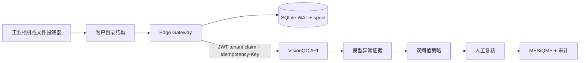

# VisionQC Industrial Edge Gateway 部署与运维手册

本手册定义 VisionQC 第一版目录型工业边缘采集链路。范围是“相机/目录产生图片 → Gateway 稳定性检查与质量门禁 → 本地持久化队列 → 幂等上传 → VisionQC 推理与策略 → 人工复核 → MES/QMS → 关闭”。第一版不引入 Kafka、Kubernetes 或真实 RTSP；目录监听是现场相机落盘或文件交换目录的适配层。

## 1. 组件与信任边界



- Gateway 只绑定一个 Deployment Pack、一个 `target_tenant_id` 和一个 `gateway_id`。
- 后端只从签名 JWT 的 `tenant_id` 读取租户边界；请求表单、文件名、query parameter 和 `X-Tenant-ID` 都不能切换租户。
- Gateway 使用 `edge_gateway` 最小权限角色，只能上传检测和发送自身心跳，不能读取其他检测、复核、部署或外部动作。
- 质量门禁拒绝的是“输入不可用/不安全”，不是缺陷语义。模型异常、模型超时和模型不可用仍由后端作为异常证据或安全降级处理，不能写成“确认缺陷”。

## 2. Deployment Pack 合同

边缘配置必须和产品、工位、字段映射、租户绑定一起版本化。`backend/deployment-packs/manifests/factory-a-transistor.json` 和 `factory-b-bottle.json` 已包含 `edge_gateway` 节点：

```json
{
  "edge_gateway": {
    "gateway_id": "factory-a-gw-st07",
    "target_tenant_id": "factory-a",
    "watch": {
      "root": "/var/lib/visionqc-gateway/incoming",
      "relative_path_regex": "^ST-07-final$",
      "filename_regex": "^(?P<product>TR-AX14|TR-SMOKE)__...$",
      "capture_map": {
        "product_code": "product",
        "batch_no": "batch",
        "captured_at": "captured_at"
      },
      "defaults": {
        "station_code": "ST-07 / 终检",
        "product_revision": "REV-C"
      },
      "source": "edge-camera/factory-a/st07",
      "stable_for_seconds": 1.0
    }
  }
}
```

Factory A 使用 `ST-07-final/<product>__<batch>__<timestamp>__<sequence>.png`；Factory B 使用 `cell/<CELL>/date/YYYY/MM/DD/<sku>__lot=<lot>__captured=<timestamp>__seq=<sequence>.jpg`。差异全部在 manifest 的正则、capture map、defaults 和 field mapping 中，Gateway 代码没有客户 ID 分支。

接入或修改客户时：

```bash
python scripts/validate_deployment_pack.py \
  backend/deployment-packs/manifests/factory-a-transistor.json \
  backend/deployment-packs/manifests/factory-b-bottle.json
```

修改后必须重新校验、审批、激活 Deployment Pack，并记录 Gateway 版本与 pack 版本的对应关系。生产部署不允许让网关读取任意可写目录中的未审批 JSON。

## 3. 运行模式与身份

### Demo/test

Compose 使用 `VQC_GATEWAY_MODE=demo`。没有显式 `VQC_GATEWAY_AUTH_TOKEN` 时，Gateway 仅为演示通过共享开发 secret 生成五分钟 JWT：

- `sub` 是 manifest 的 `gateway_id`。
- `tenant_id` 是 manifest 的 `target_tenant_id`。
- `roles` 只有 `edge_gateway`。
- 上传同时带 `X-Gateway-ID`，后端要求它和 JWT subject 一致。

这只用于本地演示，不能把共享 secret 或 demo token 带入生产。

### Production

生产 Gateway 必须设置：

```bash
VQC_GATEWAY_MODE=production
VQC_GATEWAY_AUTH_TOKEN=<由企业 IdP/secret provider 注入的短期 token>
VQC_GATEWAY_STATUS_TOKEN=<由 secret provider 注入的本地状态 API token>
VQC_GATEWAY_PACK_PATH=/etc/visionqc/deployment-packs/customer.json
```

生产 token 应只授予一个租户、一个 Gateway subject 和 `edge_gateway` scope/role；轮换通过 secret provider 完成，不把 token 写入 pack、镜像、日志或 SQLite。生产关闭 demo tenant switch endpoint，租户切换由企业 IdP membership + step-up 流程完成。

## 4. 启动与模拟器

完整 Compose：

```bash
cd infra
docker compose up --build
```

网关状态 API：

- Factory A：`http://localhost:8091/status`
- Factory B：`http://localhost:8092/status`
- 本地队列：`/queue?limit=100`
- 失败项人工放回重试：`POST /queue/{id}/retry`
- 强制运行一轮扫描/上传/心跳：`POST /cycle`

模拟器按 Deployment Pack 规则写目录，不依赖真实硬件：

```bash
cd infra
docker compose --profile simulator up --build
```

或者直接运行：

```bash
cd edge-gateway
uv run --extra dev python -m edge_gateway.simulator \
  --pack ../backend/deployment-packs/manifests/factory-b-bottle.json \
  --root /tmp/factory-b-incoming \
  --kind normal anomaly dark overexposed blurry corrupt duplicate \
  --continuous --interval 5
```

完整栈启动后，可用以下脚本检查两个网关的本地状态、后端心跳和跨租户隔离：

```bash
uv run --directory backend python ../scripts/edge_gateway_smoke.py
```

`duplicate` 使用相同内容和上下文生成不同文件名；网关会写入 `DUPLICATE` 审计行，但不会创建第二个后端检测。

## 5. 可靠性与恢复

1. 文件先经过 unchanged size/mtime 稳定窗口，再读取并做一次前后 stat 比对；仍在写入的文件进入下一轮，不会读取半张图。
2. 接受的原图先原子复制到 `data_dir/spool`，然后才写 SQLite `QUEUED`。spool 是断网缓存和上传重启恢复的事实来源。
3. SQLite 开启 WAL；`UPLOADING` 在进程启动时会恢复为 `FAILED + retryable`。网络、超时、429 和 5xx 按指数退避；永久 4xx、身份错误、坏 spool 保留为不可自动重试失败项，等待人工处理。
4. 成功上传行保留 `inspection_id`、内容哈希、上下文和幂等键，不立即删除。这样可以审计“本地样本 → 后端检测”的对应关系。
5. 后端已有 `(tenant_id, idempotency_key)` 唯一约束；Gateway key 是租户、pack 版本、内容 SHA-256 和 canonical context 的确定性 SHA-256。重复请求得到原检测，不重复推理或建单。

故障恢复演练：

```bash
# 断开 API 或网络，观察 /status 的 queue_depth 增长
# 恢复 API 后，网关自动补传
curl -X POST http://localhost:8091/cycle
curl http://localhost:8091/queue?limit=20
```

不得手工删除 `gateway.sqlite3` 或 `spool/` 来“清空积压”；这会破坏审计和未上传证据。需要清理时先导出/备份队列，再按保留策略处理。

## 6. 图片质量门禁与审计

门禁顺序和默认指标：

| 检查 | 默认规则 | 拒绝码 |
| --- | --- | --- |
| 格式 | 扩展名与实际 PNG/JPEG 解码格式一致 | `UNSUPPORTED_FORMAT` / `FORMAT_MISMATCH` |
| 安全解码 | Pillow 完整解码、Decompression Bomb、空文件 | `SECURITY_DECODE_FAILED` |
| 尺寸 | 不能低于最小宽高或超过最大像素 | `IMAGE_TOO_SMALL` / `IMAGE_DIMENSIONS_UNSAFE` |
| 清晰度 | 灰度相邻像素 edge energy ≥ `min_sharpness` | `BLURRY` |
| 亮度 | 均值不能低于 `dark_mean_threshold` | `TOO_DARK` |
| 饱和 | 均值或饱和像素比例不能超过门槛 | `OVEREXPOSED` |
| 上下文 | 路径/文件名能映射产品、批次、工位、时间 | `CONTEXT_INCOMPLETE` 等 |

每个拒绝在 SQLite 保存时间、源路径、文件名、pack、拒绝码、中文原因和可调指标；文件移动到 `.quarantine`。这些是采集质量事件，不是缺陷标签。Gateway 的 `/status` 返回最近错误，后端看板返回最近心跳和上传失败计数。

## 7. 后端与前端运行状态

Gateway 使用 `POST /api/v1/gateways/heartbeat` 报告版本、工位、队列深度、最近错误和累计上传计数。后端以 JWT 租户过滤，提供：

- `GET /api/v1/gateways/status`：当前租户的 Gateway 状态。
- `GET /api/v1/stations/status`：同一租户过滤的兼容别名。
- 前端“运营监测”页面：在线/陈旧/离线、工位、积压、失败计数和最近心跳。

状态解释：心跳超过 `VQC_GATEWAY_STALE_SECONDS` 为 `STALE`，超过 `VQC_GATEWAY_OFFLINE_SECONDS` 为 `OFFLINE`；Gateway 自报 `DEGRADED` 或 queue depth 大于 0 时显示有积压。看板按登录用户 JWT 租户显示，不能通过 query/header 查看另一工厂。

## 8. 指标定义

| 指标 | 定义 | 用途/告警建议 |
| --- | --- | --- |
| `gateway_queue_depth` | `QUEUED + UPLOADING + retryable FAILED`（看板也保留永久失败项） | 连续 5 分钟增长或超过现场容量告警 |
| `gateway_heartbeat_age_seconds` | 当前时间减最近心跳时间 | > stale 阈值提示，> offline 阈值告警 |
| `gateway_upload_success_total` | 后端返回 2xx 的队列项数量，幂等重放不增加检测数 | 产线吞吐与恢复验证 |
| `gateway_upload_failure_total` | 网络/HTTP/本地 spool 失败数量 | 区分传输故障与输入质量拒绝 |
| `gateway_input_rejection_total{reason}` | `REJECTED` 按拒绝码计数 | 相机曝光、对焦、命名规则改进 |
| `gateway_duplicate_total` | 被确定性幂等键折叠的源观察数 | 检查相机重发和目录复制行为 |
| `inspection_idempotent_replay_total` | 后端返回原检测的重复请求数 | 验证 at-least-once 到 exactly-once 业务效果 |
| `gateway_upload_latency_ms` | 从 claim 到后端响应的耗时 | 网络/服务性能基线 |

演示数据和模拟器指标不能代表真实工厂良率、漏检率或生产 SLA；上线前需以授权现场数据重新校准质量阈值和容量告警。

## 9. 故障排查

| 现象 | 先查 | 处理 |
| --- | --- | --- |
| 队列持续增加 | `/status` 的 `recent_error`、后端 `/healthz`、网络 DNS | 恢复 API/网络；不要删除 spool，自动重试会继续 |
| `STALE/OFFLINE` | Gateway 进程、容器日志、`/healthz`、主机时钟 | 检查进程/卷权限/时间同步；确认 backend heartbeat 路径 |
| 大量 `CONTEXT_INCOMPLETE` | 文件相对路径、文件名、pack 版本 | 对照 manifest 的 regex/capture map；不要在代码中增加客户 if |
| 大量 `TOO_DARK/OVEREXPOSED/BLURRY` | rejection metrics 与相机曝光/焦距 | 先修相机 profile，再调整 pack/runtime 门槛并审批版本 |
| `UPLOAD_REJECTED` | 错误码、active pack、station/product 是否已激活 | 修复 Deployment Pack 或权限；永久失败项只在确认后人工 retry |
| `AUTH_CONFIGURATION_ERROR` | mode、token secret、JWT subject/tenant membership | 生产注入短期 token；禁止退回 demo secret |
| 重启后有 `PROCESS_RESTARTED` | SQLite 与 spool 是否仍在同一持久卷 | 保留该行，网关会按退避继续上传；确认后端幂等键未变 |
| 后端显示模型失败 | Inspection 的 `failure_reason` 与复核队列 | 这是安全降级，不能改写为“图片质量缺陷”；人工复核或恢复模型后受控重试 |

## 10. 发布门槛

- 两个 Deployment Pack 通过 schema、租户绑定、产品/工位、字段映射和策略校验。
- Gateway 单元、SQLite 队列、稳定文件、断网/重启恢复和质量门禁测试通过。
- Backend gateway heartbeat/跨租户上传测试通过；手动上传和既有多租户闭环回归通过。
- 前端 `typecheck`、组件测试和生产构建通过；Compose config/build/smoke 通过。
- 生产 token、目录卷、SQLite/spool 备份、日志脱敏、指标告警和回滚 pack 均有值班手册。
