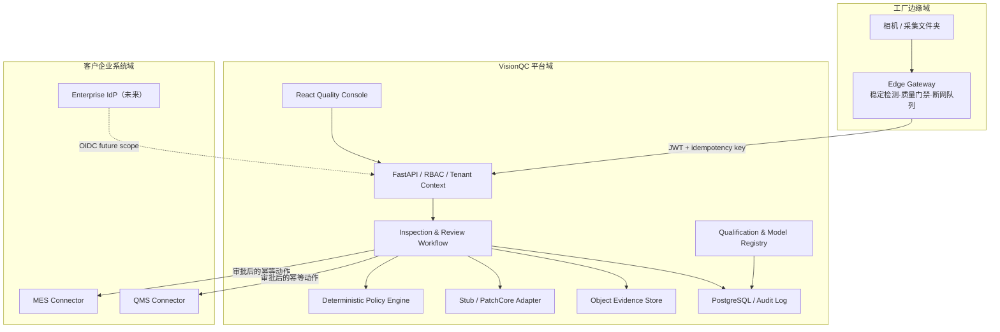
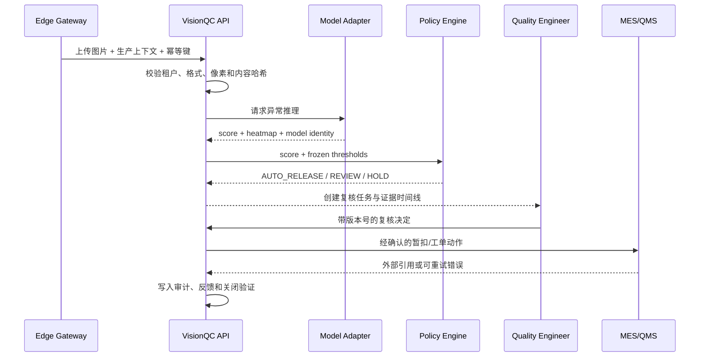
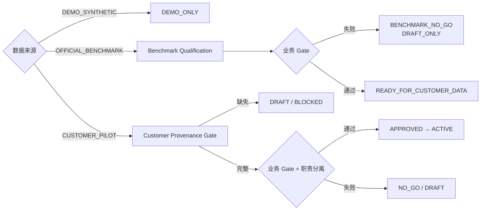

# VisionQC 系统架构

## 1. 架构目标

VisionQC 将视觉模型限制在“提供异常证据”的职责内，把业务安全交给可解释、可审计的确定性工作流。平台需要同时支持现场网络不稳定、客户字段不同、模型版本变化、人工审批和外部系统幂等写入。

## 2. 逻辑架构

## 3. 关键时序

## 4. 数据与模型发布门禁

## 5. 信任边界与控制

| 边界 | 主要风险 | 控制措施 |
| --- | --- | --- |
| 图片/归档进入平台 | 路径穿越、压缩炸弹、恶意格式 | 后缀白名单、特殊文件拒绝、大小/数量/压缩比限制、哈希 |
| 边缘到 API | 重放、跨租户上传、网络中断 | JWT tenant claim、幂等键、SQLite 队列、指数退避 |
| 模型到业务决策 | 幻觉式语义结论、错误自动放行 | 仅输出 anomaly evidence、冻结阈值、安全降级、人工复核 |
| 人工操作 | 越权、并发覆盖、缺乏追责 | RBAC、乐观锁、理由/确认字段、审计日志 |
| 外部系统写入 | 重复暂扣/重复工单 | Connector 幂等键、重试状态机、外部引用记录 |
| 模型发布 | 数据泄漏、测试集调参、证据篡改 | 固定 manifest、validation-only 校准、holdout 隔离、SHA-256 清单 |

## 6. 多客户适配

Deployment Pack 将客户差异从核心工作流中分离：

- 产品代码、字段映射和图片约束；
- 模型 ID、版本、包摘要和阈值策略；
- MES/QMS Connector 地址与动作映射；
- Gateway 路径、扩展名、站点与产线；
- 租户 UI 标签、风险策略和部署版本。

核心代码不根据客户名称写条件分支；运行时只加载并验证当前租户的 Pack。

## 7. 当前部署与生产化差距

当前 Docker Compose 用于可重复演示和集成验证。生产化仍需企业 OIDC、密钥托管、PostgreSQL RLS、对象存储生命周期策略、真实相机 SDK、消息总线、Kubernetes、真实 MES/QMS 沙箱和客户现场监控。

