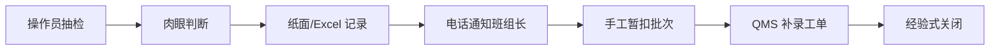
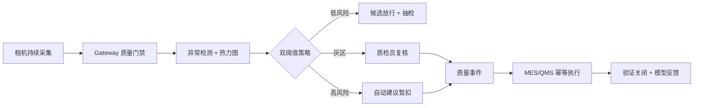
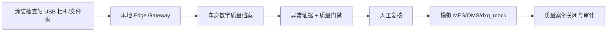

# VisionQC 客户流程案例与 48 小时接入方案

> 本文的 Dürr 部分是面向 Dürr 业务场景设计的独立作品集概念方案 / Independent portfolio concept; not commissioned or endorsed by Dürr。现有 Factory A/B 内容继续作为多租户回归夹具。

## 1. 场景

假设电子装配工厂希望对晶体管外观进行自动异常筛查。当前质检依靠抽检、纸面 SOP 和人工录入 QMS；异常图片、处置理由和批次动作分散在不同系统。

本文是作品集中的模拟 FDE 交付案例，不代表真实客户实施。

## 2. As-Is

主要问题：

- 检测覆盖率受人工节拍限制；
- 异常图片、判断和处置缺少统一证据链；
- 暂扣与工单操作可能重复或遗漏；
- 不同人员标准不一致；
- 无法可靠计算误放、复核负担和模型版本效果。

## 3. To-Be

预期变化：机器负责持续筛查，工程师保留最终质量决策权；所有模型证据、审批、外部动作和结果进入同一审计时间线。

## 4. 48 小时接入新工厂

### 0–4 小时：发现与边界

- 访谈质量、生产、IT 和安全负责人；
- 确认产品、缺陷成本、节拍、相机位置和禁止自动化的动作；
- 定义 `AUTO_RELEASE / REVIEW / HOLD` 的业务含义；
- 建立成功指标、停止条件和责任矩阵。

交付物：需求记录、As-Is 流程、风险清单、数据与权限边界。

### 4–12 小时：Deployment Pack

- 映射客户设备、产品、批次、工位字段；
- 配置 Gateway 目录、扩展名、稳定等待和质量门禁；
- 配置 MES/QMS 沙箱 Connector；
- 创建租户、角色和审计策略。

交付物：通过 Schema 校验的 Deployment Pack 与 Connector contract tests。

### 12–24 小时：数据注册与实验室验证

- 受控导入正常样本和已审批标签；
- 固化 manifest、fingerprint、calibration/holdout split；
- 构建 PatchCore feature bank；
- 冻结阈值并生成离线证据包。

交付物：数据收据、模型候选、评测报告和明确的 GO/NO-GO。

### 24–36 小时：闭环集成

- 在沙箱执行上传、推理、复核、暂扣、建单和关闭；
- 验证重试、幂等、断网恢复与跨租户隔离；
- 对失败路径执行安全降级演练。

交付物：端到端测试记录和现场验收草案。

### 36–48 小时：交接与决策

- 与质量负责人复核错误案例和人工负担；
- 完成权限矩阵、运维手册和回滚条件；
- 只有客户 provenance 与全部 Gate 通过才提交审批；
- 未通过则保持 DRAFT，并给出下一轮数据/模型计划。

交付物：签字版 Pilot 决策、操作培训和下一迭代 Backlog。

## 5. 验收矩阵

| 维度 | 验收条件 |
| --- | --- |
| 数据 | provenance 完整；manifest 可复验；无 split 泄漏 |
| 模型 | 指标、置信区间、错误案例和延迟均可追溯 |
| 安全 | 推理失败不自动放行；高风险动作需要确认 |
| 集成 | MES/QMS 幂等；失败可重试；外部引用可审计 |
| 租户 | 数据、证据、模型和操作跨租户不可见 |
| 运维 | Gateway 断网恢复、健康状态和队列积压可监控 |
| 发布 | 评估、审批、激活由不同身份完成 |

## 6. 本项目实际证明与未证明

已经证明：软件闭环、多租户适配、公开 Benchmark 评测、证据完整性和发布阻断机制可以运行。

尚未证明：真实客户相机、现场光照、产品漂移、真实 MES/QMS 和生产节拍下的业务效果。进入客户 Pilot 后必须重新采集、校准和验收。

## 7. Dürr 汽车涂装扩展概念

把同一平台映射到汽车涂装检查站时，产品不是“给 Dürr 做一个专用分类器”，而是为 DXQ 数字化栈补充边缘证据和人工闭环编排：

`duerr-demo` Deployment Pack 由 manifest 定义涂装车间、喷房/工位、产线、车型、颜色、配方和班次字段；它不在核心业务中写 `if tenant == duerr`。`dxq_mock` 仅模拟公开概念层质量记录和事件流，所有外部引用都带幂等键和审计时间线，不宣称真实 DXQ API。

中国 pilot 的作品集假设是本地部署、中文操作、数据默认不出厂、可配置连接器和低改造接入。实际 pilot 仍需要客户正式授权、相机/灯光标定、真实数据 provenance、人工标签和现场 Go/No-Go；Blender `DEMO_SYNTHETIC` 样本不能替代这些证据。
